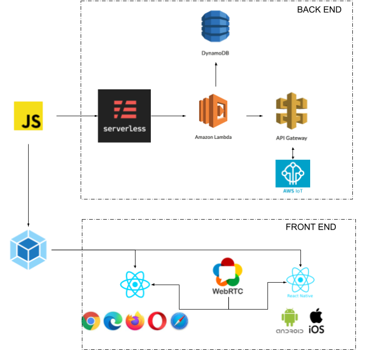

# HUB 31 Learning

## Introduction
Hub 31 is an enabler for digital university. We provide a turnkey e-learning platform dedicated to your organization with its own user accounts, course creation tools and offers the ability to monetize courses. This new platform provides private secure video hosting of lectures, help to conduct a quiz for a class or a smaller group, sharing notes and discussion forums included.

## Problem Statement
Current e-learning platforms distribute courses to the common public, but oftentimes the scope of distribution needs to be restricted to a group, organisation, a state or a country. These platforms have their own branding, run ads but seldom promote your content.

## Solution
HUB 31 provides you a secured platform to access your Lessons and Videos. Hub 31 provisions an e-learning platform that has your own branding, no ads and there is a total control on your data (including user accounts). This platform has dedicated servers for each deployment and is easily scalable.

## Goals
1. Provide a way to securely view recorded lessons and other e-learning materials.
2. Provide an e-learning platform to augment the classroom learning experience for students.
3. Mobile app for accessing entire content.
4. Easy deployment and self-maintenance of course videos, content, quizzes and groups and discussion forums.

## Design Overview

Hub 31 learning is designed such that all e-learning deployments share a common core which helps in pushing updates with zero downtime. Also the platform provisions for customising the look and feel.

Hub 31 web uses React for front-end and React Native for mobile access. Hub 31 uses Serverless for backend API, IoT for interactive features and WebRTC for live streaming. Since there are no servers to maintain, the cost of running is minimised and charged only for the usage.

Hub 31 learning allows scaling  to infinite students. Each platform provides tools for creating courses, adding documents, preparing quizzes, adding videos and conducting live classes. The platform also has a full-size discussion forum for each course.
